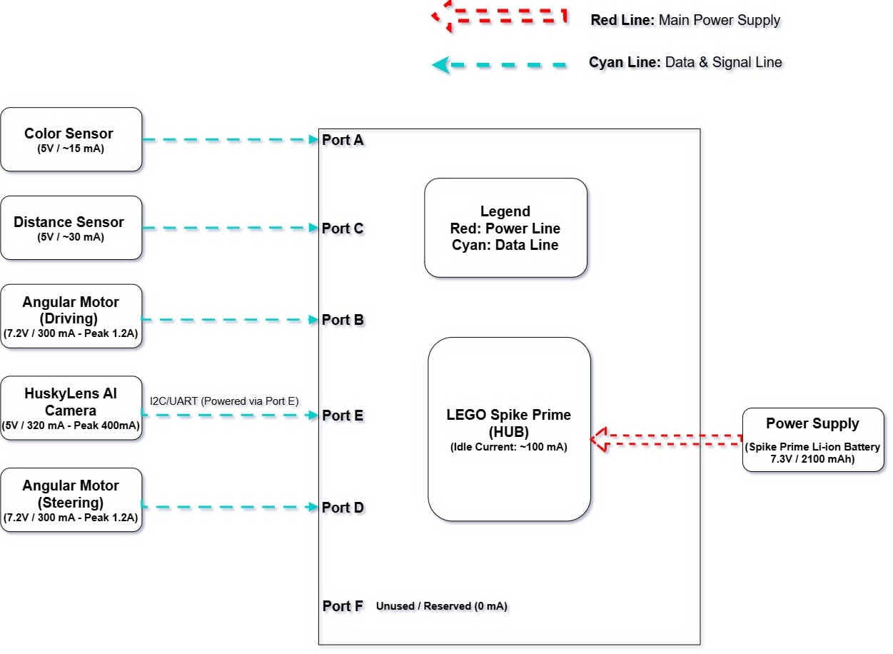

# 🏎️ WRO Future Engineers 2026

| Field | Details |
| :--- | :--- |
| **Category** | WRO Future Engineers 2026 |
| **Team Name** | **[CIS.exe]** |
| **Country** | Thailand 🇹🇭 |
| **Document Status** | Initial Template & Hardware Setup |

---

## 1. Team Introduction

### 1.1 Team Members

* **Thanarat Chansamak**
  * **Role:** Hardware Engineer
  * **Responsibilities:** Mechanical Chassis Design, Steering Mechanism, 3D Component Printing, and Electronics Wiring.
* **Sorawit Namwongsa**
  * **Role:** Software Engineer
  * **Responsibilities:** MicroPython Programming, HuskyLens AI Vision System, Sensor Calibration, and Navigation Algorithms.
* **Puttipong Kittichotthaworn**
  * **Role:** Software Engineer
  * **Responsibilities:** MicroPython Programming, HuskyLens AI Vision System, Sensor Calibration, and Navigation Algorithms.

### 1.2 Team Goals & Motivation

Our primary goal for the WRO Future Engineers 2026 challenge is to develop a fully autonomous vehicle capable of navigating complex field paths using Ackermann steering and vision-based decision making. Driven by our passion for robotics and embedded software engineering, we aimed to implement a sensor fusion strategy combining a Color Sensor, Distance Sensor, and HuskyLens AI Camera.

Through this project, our team strives to master the engineering design process by systematically testing, calibrating, and resolving hardware-software bottlenecks (such as steering angles and timing limits). Our target is to create a robust, adaptable system that consistently completes all 3 laps and parks successfully, while documenting our entire journey open-source on GitHub.

---

## 2. Competition & Field

### 2.1 Game Overview
The WRO Future Engineers 2026 challenge requires teams to design, build, and program a fully autonomous vehicle capable of navigating a structured indoor racetrack. The vehicle must make real-time decisions, maintain path stability, avoid obstacle traffic blocks, and complete the designated mission without any external human control or remote signals.

### 2.2 Field Layout & Specifications
* **Track Dimensions:** The overall field mat measures approximately 3000 mm × 2000 mm, enclosed by 100 mm high outer and inner white walls, creating a driving lane width of 400 mm – 500 mm.
* **Traffic Markings:**
  * **Blue Lines:** Transverse lines used to mark sector transitions and count completed laps.
  * **Orange Lines:** Directional guide lines placed at corners and turns to signal steering maneuvers.
  * **Parking Zone:** A designated rectangular zone marked on the field mat where the vehicle must perform a controlled stop upon mission completion.

### 2.3 Obstacle Rules & Pillar Logic
During the Obstacle Challenge, traffic pillars (50 mm × 50 mm base, 100 mm – 250 mm height) are placed randomly along the driving lanes:
* **Green Pillar (ID 1):** The vehicle must identify the color/ID using onboard vision and pass on the **LEFT** side of the pillar.
* **Red Pillar (ID 2):** The vehicle must identify the color/ID using onboard vision and pass on the **RIGHT** side of the pillar.
* **Safety Constraint:** Touching, moving, or knocking over any pillar or wall results in point deductions or run invalidation.

### 2.4 Technical Constraints & Mission Objectives
* **Autonomous Operation:** 100% onboard execution using the LEGO SPIKE Prime hub, Color Sensor, Distance Sensor, and HuskyLens AI Camera.
* **Ackermann Steering Mandate:** The vehicle design must utilize realistic front-wheel Ackermann steering geometry rather than differential drive.
* **Dimensional Limits:** The vehicle dimensions must fit within 300 mm (Length) × 200 mm (Width) × 300 mm (Height).
* **Primary Objectives:** Complete 3 consecutive laps accurately, navigate all obstacles successfully, and execute a final parking maneuver in the designated zone.

---

## 3. Robot Overview

### 3.1 Design Philosophy
The core design strategy of our robot centers on modularity, mechanical stability, and high operational reliability. Rather than building a complex or over-engineered frame, we focused on a lightweight, low-center-of-gravity chassis using LEGO Technic structural components. This ensures predictable driving dynamics, minimal structural flex, and rapid maintenance during competition rounds.

### 3.2 Vehicle Architecture & Drive System
* **Ackermann Steering Mechanism:** The front axle features a true Ackermann steering geometry powered by a dedicated steering motor (Port B). This mechanism ensures that the inner and outer front wheels turn at appropriate relative angles during cornering, drastically reducing tire slip and maintaining precise directional control through sharp turns.
* **Rear Wheel Drive Train:** Propulsion is delivered by a drive motor (Port D) connected directly to the rear axle. Rear-wheel drive provides strong traction and predictable acceleration without interfering with the front steering assembly.

### 3.3 Strategic Sensor Integration
To execute accurate line-tracking and obstacle avoidance, sensors are positioned to maximize data reliability:
* **Color Sensor (Port A):** Mounted at the lower front chassis facing downward, close to the surface, to instantly detect Orange corner lines and Blue lap markers without interference from ambient light.
* **Distance Sensor (Port C):** Positioned on the front bumper facing directly ahead to trigger the obstacle avoidance state when an object comes within 25 cm.
* **HuskyLens AI Camera (Port E):** Elevated on the upper front frame with a clear field of view to inspect and classify obstacle pillars (Red ID 2 / Green ID 1) as the vehicle approaches.

### 3.4 Key Technical Specifications

| System | Specification Details |
| :--- | :--- |
| **Main Controller** | LEGO SPIKE Prime Hub (Built-in 6-axis IMU) |
| **Programming Language** | MicroPython |
| **Drive Mechanism** | Rear-Wheel Drive (RWD) via Angular Motor (Port D) |
| **Steering Mechanism** | Ackermann Geometry Front Axle via Angular Motor (Port B) |
| **Vision System** | DFRobot HuskyLens AI Camera (Port E - UART) |
| **Primary Sensors** | 1x SPIKE Color Sensor (Port A), 1x SPIKE Distance Sensor (Port C) |

---

## 4. Mechanical Design

### 4.1 Steering & Drive System

#### 1. Steering Mechanism (Ackermann Steering Geometry)
* **Design Principle:** Implements Ackermann Steering Geometry, ensuring the inner steering wheel turns at a sharper angle than the outer wheel during turns around a common center point.
* **Purpose & Advantage:** Minimizes tire scrub and side-slippage on the track surface, maintaining vehicle stability, traction, and high-speed momentum throughout sharp cornering.
* **Linkage Integration:** Controlled by a dedicated LEGO Medium Angular Motor (Port B) via rigid steering linkages, delivering precise angular displacement and reliable re-centering.

#### 2. Drive Train Architecture
* **Drive Configuration:** Rear-Wheel Drive (RWD) layout powered by a LEGO Medium Angular Motor (Port D).
* **Power Transmission:** Direct gear transmission connecting the drive motor directly to the rear drive axle, maximizing torque transfer efficiency and eliminating belt slip.
* **Tires & Traction:** Equipped with high-friction rubber tires to ensure optimal ground adhesion during speed shifts and dynamic obstacle avoidance.

### 4.2 Vehicle Photos (6-Axis Views)

  
  
   
  <b>Figure 4.1:</b> Front View (Left) and Back View (Right)

  
  
   
  <b>Figure 4.2:</b> Left Side View (Left) and Right Side View (Right)

  
  
   
  <b>Figure 4.3:</b> Top View (Left) and Bottom View (Right)

---

## 5. Electronics & Sensors

### 5.1 Hardware Port Mapping

| Port | Component | Model / Specs | Primary Function / Mission Role |
| :---: | :--- | :--- | :--- |
| **A** | Color Sensor | LEGO SPIKE Color Sensor | Detects RGB values and color intensity for Orange corner lines and Blue lap counter markers. |
| **B** | Steering Motor | LEGO SPIKE Medium Angular Motor | Controls front axle steering angle based on Ackermann geometry. |
| **C** | Distance Sensor | LEGO SPIKE Distance Sensor | Measures frontal clearance distance to obstacle pillars. |
| **D** | Drive Motor | LEGO SPIKE Medium Angular Motor | Drives rear axle for vehicle forward and reverse propulsion. |
| **E** | AI Vision Camera | DFRobot HuskyLens | Performs real-time image processing and classification of Red (ID 2) and Green (ID 1) obstacle pillars. |

### 5.2 Power & Communication Architecture
* **Main Microcontroller:** LEGO SPIKE Prime Hub equipped with an ARM Cortex-M4 processor running embedded MicroPython firmware.
* **Power Supply:** Integrated 2100 mAh Li-ion rechargeable battery pack housed inside the SPIKE Prime Hub, providing stable and regulated power distribution to all connected actuators and sensors.
* **Camera Interface:** DFRobot HuskyLens communicates with the SPIKE Prime Hub through Port E via UART serial protocol, transmitting detected object IDs, coordinates, and bounding box dimensions in real-time.

### 5.3 Sensor Placement & Mounting Rationale
* **Color Sensor (Port A):**
  * **Position:** Mounted at the lower center-front chassis, facing downwards with a 5 mm ground clearance.
  * **Rationale:** Keeps the optical sensor close to the track surface to eliminate ambient light interference, ensuring high accuracy when distinguishing Orange turn markers and Blue lap-counting lines.
* **Distance Sensor (Port C):**
  * **Position:** Mounted on the front bumper, aligned precisely with the vehicle’s central axis.
  * **Rationale:** Provides an unobstructed, straight-line conical field of view to reliably detect approaching obstacle pillars without triggering false positives from outer perimeter walls.
* **HuskyLens AI Camera (Port E):**
  * **Position:** Elevated on the top front frame with a 15-degree downward pitch angle.
  * **Rationale:** Prevents blind spots caused by the front bumper and expands the field of view to classify Red (Right Pass) and Green (Left Pass) pillars well in advance of steering execution.

### 5.4 Wiring Schematic
*(Insert exported hardware wiring diagram image from draw.io or Fritzing here)*
> **Figure 5.1:** Complete System Hardware Wiring Diagram and Port Allocation Schematic.

---

## 6. Key Components Used

The robot system integrates the operation of the main processing unit, positional sensors, drive mechanisms, and an AI vision processing camera, categorized into the following key components:

### 6.1 LEGO SPIKE Prime Large Hub (Main Controller)

  

* **Device Name:** LEGO SPIKE Prime Large Hub
* **Role and Function:** Serves as the Main Processing Unit to run the MicroPython program. It processes data from all sensors, controls the steering direction, manages drive motor speeds, and communicates with the HuskyLens camera.
* **Key Features Used on the Field:**
  * **Built-in 6-axis Gyro Sensor (IMU):** Reads orientation angles (Yaw Angle) for the Gyro Control algorithm, allowing the robot to drive precisely straight along the track.
  * **6 Multi-function Ports (A–F):** Connects devices according to the robot's Port Mapping (Port A: Color Sensor, Port B: Steering Motor, Port C: Distance Sensor, Port D: Drive Motor, Port E: HuskyLens UART).
  * **MicroPython Execution:** Supports high-speed loop processing, enabling real-time sensor reading and immediate, lag-free obstacle response.

---

### 6.2 LEGO SPIKE Prime Distance Sensor (Port C)

  

* **Device Name:** LEGO SPIKE Prime Distance Sensor (Ultrasonic Sensor)
* **Role and Function:** Measures the distance to objects directly in front of the robot using ultrasonic waves. It serves as the primary trigger for detecting obstacles (pillars) along the race track.
* **Key Features Used on the Field:**
  * **Obstacle Detection Threshold:** Continuously monitors the front path with a distance threshold of 35.0 cm (`OBSTACLE_CM`).
  * **Avoidance State Trigger:** When an object is detected within 35.0 cm, it immediately signals the system to read the HuskyLens AI camera and execute the dodge maneuver.
  * **Non-blocking Distance Checking:** Reads real-time distance data via `dist.get_distance_cm()` without delaying the main control loop.

---

### 6.3 LEGO SPIKE Prime Color Sensor (Port A)

  

* **Device Name:** LEGO SPIKE Prime Color Sensor
* **Role and Function:** Positioned facing downward toward the track surface to read ground colors. It acts as the primary navigation sensor for corner detection, lap counting, and track boundary safety.
* **Key Features Used on the Field:**
  * **Cornering Trigger:** Continuously scans ground colors to detect the orange line (`ORANGE`), triggering the autonomous cornering sequence.
  * **Turn Exit & Lap Counter:** Detects the blue line (`BLUE`) to confirm the end of a turn, lock the new Gyro target heading, and increment the lap counter (`lap_count`).
  * **Track Boundary Recovery:** Detects green lines (`GREEN`) along track boundaries for emergency path correction to prevent the robot from driving off-course.

---

### 6.4 LEGO SPIKE Prime Medium Angular Motor – Drive (Port D)

  

* **Device Name:** LEGO SPIKE Prime Medium Angular Motor (Drive Motor)
* **Role and Function:** Powers the main drive axle to propel the robot forward with dynamic speed management across different navigation states.
* **Key Features Used on the Field:**
  * **Dynamic Speed Control:** Adjusts power dynamically according to active states (Cruise Speed: 15%, Obstacle Avoidance: 11%, Cornering: 12%).
  * **Precise Execution:** Responds instantly to stop commands upon completing 3 full laps (`lap_count >= 3`).

---

### 6.5 LEGO SPIKE Prime Medium Angular Motor – Steering (Port B)

  

* **Device Name:** LEGO SPIKE Prime Medium Angular Motor (Steering Motor)
* **Role and Function:** Drives the front steering mechanism, providing precise angular adjustments for vehicle turning and directional alignment.
* **Key Features Used on the Field:**
  * **Absolute Encoder Positioning:** Allows precise steering angle calibration for straight driving and sharp cornering (Center = 2, Max Left = 337, Max Right = 28).
  * **State-Locked Steering Control:** Uses efficient positioning functions (`center_safe()`, `left_max()`, `right_max()`) to eliminate redundant motor commands and minimize system response time.

### 6.6 DFRobot HuskyLens AI Camera (Port E)

  

* **Device Name:** DFRobot HuskyLens AI Vision Camera
* **Role and Function:** Serves as the primary computer vision system to detect and classify traffic obstacles (pillars) along the racetrack. It processes image frames on onboard AI hardware and sends target information to the main hub via UART.
* **Key Features Used on the Field:**
  * **Onboard AI Color Recognition:** Runs high-speed color detection algorithms directly on the camera hardware without burdening the SPIKE Prime Hub's main CPU.
  * **UART Serial Communication:** Transmits binary data packets containing detected Color IDs (ID 1: Green, ID 2: Red) and bounding box parameters to Port E at 115,200 baud.
  * **Real-time Obstacle Classification:** Instantly informs the Finite State Machine (FSM) to decide whether to execute a Left Bypass (Green) or Right Bypass (Red) steering maneuver.

---

### 6.7 LEGO SPIKE Prime Wheels and Tires

  

* **Device Name:** LEGO SPIKE Prime Wheels (Cyan Rubber Tires & Black Rims)
* **Role and Function:** Provides mechanical traction and mobility for the vehicle. The rear wheels transmit driving torque from the motor to propel the robot forward, while the front wheels pivot on the steering assembly to change directions.
* **Key Features Used on the Field:**
  * **High-Traction Rubber Surface:** Delivers optimal surface grip on the track mat, preventing tire slippage during sudden acceleration, dynamic braking, and sharp cornering maneuvers.
  * **Low-Scrub Front Wheels:** Mounted on Ackermann steering knuckles to allow smooth angular pivoting with minimal lateral friction during turns.
  * **Direct Axle Mounting:** Connects securely to the rear axle drive train to deliver 1:1 torque transmission without power loss.

---

## 7. Computer Vision & AI Integration

### 7.1 HuskyLens Configuration & Color Training
The DFRobot HuskyLens is set to **Color Recognition Mode** and calibrated under venue lighting conditions:
* **Color ID 1 (Green Pillar):** Triggers a **LEFT** bypass steering maneuver.
* **Color ID 2 (Red Pillar):** Triggers a **RIGHT** bypass steering maneuver.

### 7.2 UART Data Decoding
The SPIKE Hub reads binary data packets from HuskyLens via Port E at 115,200 baud rate. The algorithm verifies header bytes (`0x55`, `0xAA`) to extract the detected object ID and update the vehicle state instantaneously without delaying the main control loop execution.

## 8. Software Architecture & Control Algorithms
### 8.1 Software Architecture Overview
The software logic is developed in **MicroPython** for the LEGO SPIKE Prime environment. To ensure rapid response times during high-speed driving and real-time vision processing, the codebase is structured around a **Non-blocking Loop Architecture** with an execution cycle time of approximately $5\text{ ms}$. This structure prevents blocking functions (such as standard delays) from delaying critical sensor evaluation, enabling parallel execution of vision decoding, distance measurement, and motion control.
+-------------------------------------------------------+
   |                  Sensors & Data Input                 |
   |  (Color Sensor, Distance Sensor, Gyro IMU, HuskyLens) |
   +---------------------------+---------------------------+
                               |
                               v
   +-------------------------------------------------------+
   |           Non-Blocking UART & Sensor Parser           |
   +---------------------------+---------------------------+
                               |
                               v
   +-------------------------------------------------------+
   |               Finite State Machine (FSM)              |
   |     Determines Active Driving State & Priority Level  |
   +---------------------------+---------------------------+
                               |
                               v
   +-------------------------------------------------------+
   |                Motion & Actuator Control              |
   |  (Gyro Straight PID, Steering Lock, Dynamic Speed)   |
   +-------------------------------------------------------+

---

## 8. Electrical & Power Management Architecture

### 8.1 Power Distribution & Signal Schematic

  
   
  <b>Figure 8.1:</b> Electrical Block Diagram, Power Distribution, and Port Allocation Schematic

### 8.2 Wiring & System Power Breakdown

The vehicle operates on a single centralized power source managed by the SPIKE Prime Hub. Power distribution and signal communication lines are categorized as follows:

* 🔴 **Red Line (Main Power Supply):** 7.3V regulated power rail supplied directly from the internal Li-ion battery to the SPIKE Prime Hub.
* 🔵 **Cyan Line (Data & Signal Line):** Bus communication lines providing target power delivery and continuous sensor data feedback across Hub ports.

| Connected Device | Port | Voltage | Nominal Current | Peak Current | Communication / Power Protocol |
| :--- | :---: | :---: | :---: | :---: | :--- |
| **SPIKE Prime Hub** | Internal | 7.3V | ~100 mA (Idle) | — | Main Controller & Power Bus |
| **Color Sensor** | Port A | 5.0V | ~15 mA | — | Analog/Digital Sensor Data Bus |
| **Drive Angular Motor** | Port B | 7.2V | 300 mA | 1.2 A | Bidirectional PWM & Quadrature Encoder |
| **Distance Sensor** | Port C | 5.0V | ~30 mA | — | Ultrasonic Signal Data Bus |
| **Steering Angular Motor** | Port D | 7.2V | 300 mA | 1.2 A | Bidirectional PWM & Quadrature Encoder |
| **HuskyLens AI Camera** | Port E | 5.0V | 320 mA | 400 mA | UART / I2C Serial Data (Powered via Port E) |
| **Reserved / Unused** | Port F | — | 0 mA | 0 mA | Available for Expansion |

### 8.3 Power Consumption & Battery Management

* **Total Battery Capacity:** 7.3V / 2100 mAh Rechargeable Li-ion Battery.
* **Maximum Peak Current Draw:** ~3.0 A (calculated under simultaneous peak steering, maximum drive acceleration, and active AI vision processing).
* **Battery Safety & Stability:** Power delivery is regulated internally by the SPIKE Hub to prevent voltage sag from degrading sensor reading accuracy or causing micro-controller reset loops during high-torque motor maneuvers.

---

## 9. Testing & Calibration Log

| Iteration | Identified Issue | Root Cause | Engineering Solution |
| :---: | :--- | :--- | :--- |
| **v1.0** | Vehicle drifted off-center during straight runs. | Motor speed variances between individual ports. | Implemented Gyro Yaw feedback loop with dynamic proportional steering correction ($K_p = 0.8$). |
| **v1.1** | HuskyLens frame drops caused delayed obstacle responses. | Blocking serial read execution inside the main control loop. | Rewrote the UART driver into a non-blocking stream buffer parser. |
| **v1.2** | Color Sensor missed Orange turn markers under bright ambient lighting. | Optical reflection interference from overhead room lights. | Designed a 3D-printed optical light shield and lowered sensor ground clearance to 5 mm. |
| **v1.3** | Rear wheel slippage during sharp corner exits. | Sudden speed transitions during FSM state changes. | Implemented dynamic speed scaling (Cruise: 15%, Avoid: 11%, Corner: 12%) for smooth torque delivery. |

---

We would like to express our deepest gratitude to everyone who supported, guided, and inspired us throughout the development of this project:

* 🤖 **World Robot Olympiad (WRO) Committee:** For organizing this challenging competition and providing an invaluable platform for young engineers to innovate and learn.
* 👨‍🏫 **Mentors & Advisors:** For their endless patience, technical guidance, and constructive feedback during our hardware debugging and algorithm development.
* 🏫 **School & Institution:** For providing the laboratory facilities, testing environments, and financial support for component procurement.
* 🛠️ **Open-Source Community:** Special thanks to the developers of the **LEGO SPIKE Prime**, **HuskyLens (DFRobot)**, and Python micro-framework communities for their comprehensive documentation and open-source libraries.
* 👥 **Team Members & Families:** For their dedication, hard work, late-night troubleshooting sessions, and unwavering encouragement.

---

  <b>Developed with ❤️ and passion by Team CIS</b> 
  WRO 2026 Future Engineers Competition

